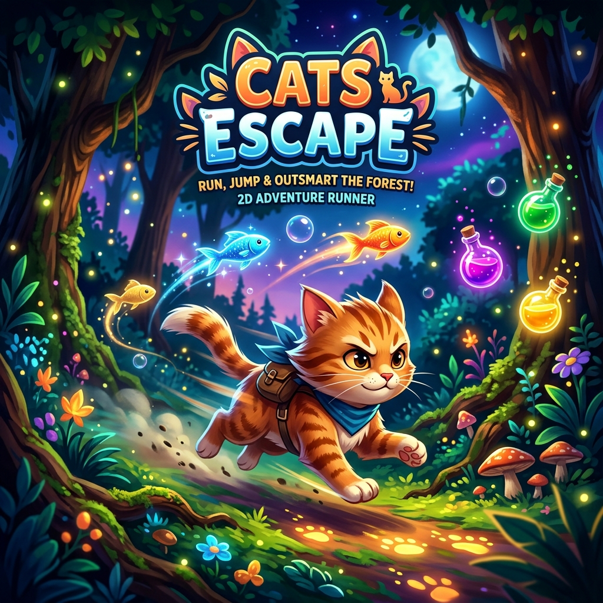

# Cats Escape 🐈💨


**Cats Escape** is a high-octane, professional 2D side-scrolling runner built with Unity. Embark on a thrilling journey as a nimble cat escaping through diverse environments, collecting rewards, and outsmarting obstacles. With a robust backend and global leaderboard, every jump counts!

---

## 🎮 Game Mechanics

### Core Gameplay
*   **Progressive Difficulty:** Navigate through 5 unique, thematic levels where speed and obstacle density increase as you advance.
*   **Thematic Environments:** Experience changing backgrounds and assets—from serene forests to challenging urban landscapes.
*   **Level Transitions:** Seamless transitions between levels featuring cinematic animations and video support.
*   **Portal System:** Reach the final portal in Level 5 to secure your victory and submit your high score.

### Collectibles & Power-ups
*   **🐟 Fish:** Your primary source of **XP** and health. Collect them to climb the leaderboard!
*   **🧪 Potions:** Transform into the **"Big Cat"**! Gain temporary invincibility, increased jump height, and a speed boost.
*   **🏠 Home Exit:** Complete Levels 1-4 by reaching the "Home" gate to safely transition to the next stage.

### Movement System
*   **Better Jump:** Custom physics implementation for responsive, snappy jumping and double-jumping.
*   **Speed Smoothing:** Intelligent speed management that ensures difficulty curves feel natural and fair.

---

## 🕹️ How to Play

### Controls
| Action | PC/Mac Controls | Mobile Controls |
| :--- | :--- | :--- |
| **Move Left/Right** | `A / D` or `Left/Right Arrow` | On-screen Joystick / Buttons |
| **Jump / Double Jump** | `Space` or `W` or `Up Arrow` | Jump Button |
| **Pause Game** | `Escape` or `P` | Pause Icon |
| **Retry / Submit** | `Space` (on Game Over) | UI Buttons |

---

## 🛠️ Technical Stack

### Frontend (Unity Engine)
*   **Engine:** Unity 2022.x+
*   **Rendering:** **Universal Render Pipeline (URP)** for modern, optimized 2D lighting and post-processing.
*   **Language:** C# (Object-Oriented Architecture).
*   **Input:** New Unity Input System for cross-platform compatibility.
*   **UI:** TextMeshPro for crisp typography and responsive layouts.
*   **Networking:** `UnityWebRequest` for secure REST API communication.

### Backend (Node.js API)
*   **Runtime:** Node.js
*   **Framework:** Express.js
*   **Database:** **MongoDB** (via Mongoose) for persistent player profiles and leaderboard data.
*   **Security:** **Firebase Admin SDK** for verifying Google ID tokens and securing user sessions.
*   **Architecture:** RESTful API with dedicated routes for game data, activity logging, and leaderboard management.

---

## 🌐 Advanced Features

### 🔐 Authentication System
*   **Google Sign-In:** Secure authentication using Google Identity.
*   **Guest Mode:** Jump straight into the action without an account.
*   **Account Linking:** Seamlessly transition from Guest to Google Play/Cloud accounts (planned).

### 📶 Offline-First Architecture
*   **Resilient Play:** The game features a **Pending Score Queue**. Earn XP while offline, and the game will automatically sync with the server once a connection is re-established.
*   **API Timeouts:** Robust error handling prevents the game from hanging during network fluctuations.
*   **Guest Fallback:** Full gameplay support even in completely offline environments.

### 📊 Global Leaderboard
*   **Real-time Sync:** Compete with players worldwide for the top XP spot.
*   **Activity Tracking:** Detailed logging of game starts, level completions, and abandoned runs for performance analytics.

---

## 🚀 Setup & Installation

### 1. Backend Setup
1.  Navigate to the `backend` directory.
2.  Install dependencies:
    ```bash
    npm install
    ```
3.  Configure `.env` with your `MONGODB_URI` and `FIREBASE_SERVICE_ACCOUNT_PATH`.
4.  Start the server:
    ```bash
    node server.js
    ```

### 2. Unity Project
1.  Open the project in **Unity Hub** (Version 2022.3+ recommended).
2.  Open the `Assets/Scenes/Main Menu` scene.
3.  Ensure the `AuthManager` and `LeaderboardManager` in the hierarchy are pointing to your server's URL (Default: `http://localhost:5001`).
4.  Press **Play** and enjoy!

---

## 📄 License
This project is for educational and personal use. All assets are property of their respective owners.


